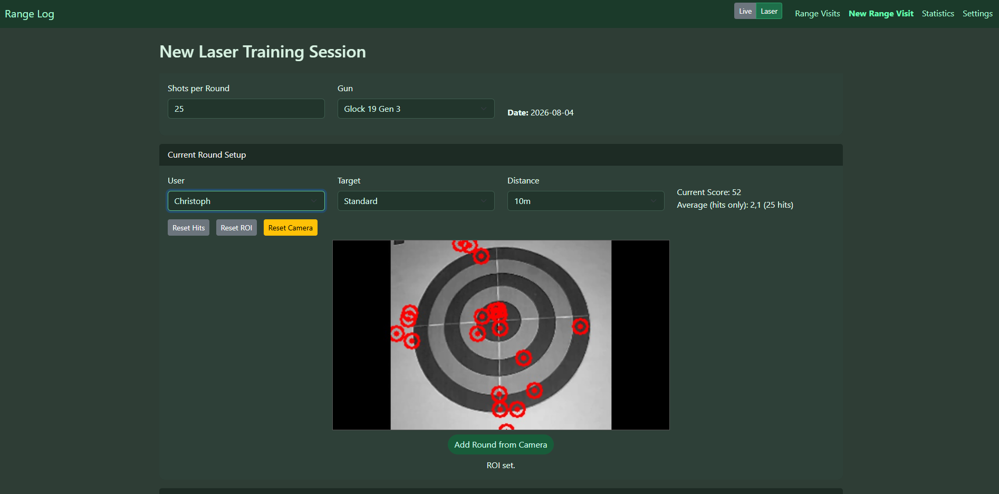
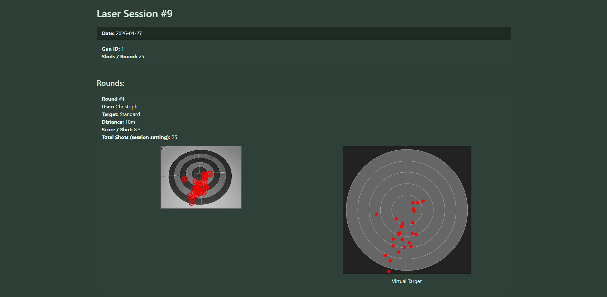
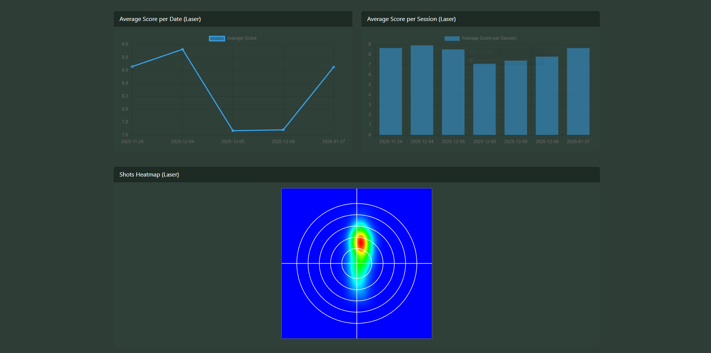
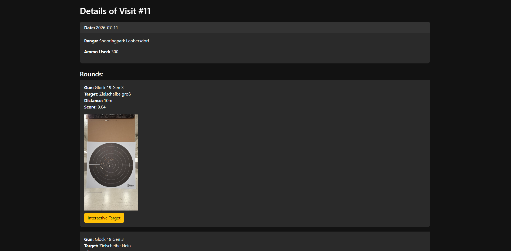
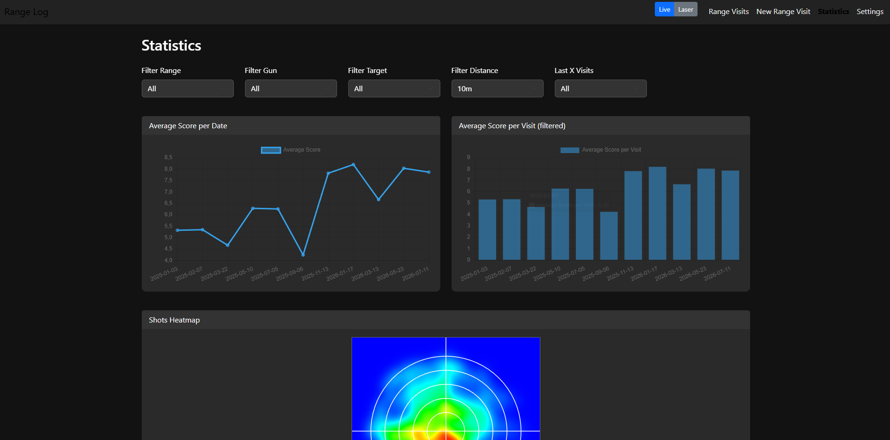

# Range Log

Range Log is a self-hosted Flask application for documenting shooting-range visits and analysing training results. It combines a conventional **Live Mode** for recording real range sessions with a camera-assisted **Laser Mode** that detects laser hits from an RTSP video stream.

The application stores visits, rounds, shots, equipment and settings locally in JSON files. It provides session details, interactive targets, score charts and shot heatmaps without requiring an external database.

> [!IMPORTANT]
> This project is intended as a personal training and record-keeping tool. Always follow local laws, range rules and safe firearm-handling practices. The software must never be treated as a substitute for proper supervision, safety equipment or professional instruction.

## Features

### Live Mode

- Record shooting-range visits with date, range and ammunition usage
- Add multiple rounds per visit
- Assign a firearm, target type, distance and score to every round
- Upload target photographs
- Open an interactive target view for recorded rounds
- Browse and delete previous visits
- Filter statistics by range, firearm, target, distance and recent visits
- Display average scores per date and per visit
- Visualise shot distribution as a heatmap

### Laser Mode

- Connect to an IP camera through an RTSP stream
- Select a region of interest around the target
- Detect and mark laser hits with OpenCV
- Calculate scores from configurable target-ring radii
- Limit the number of detected shots per round
- Reset hits, target region or camera connection
- Save camera snapshots and detected hit coordinates
- Organise sessions by user, firearm, target and distance
- Display a reconstructed virtual target
- Analyse average scores and shot heatmaps

### Local configuration

The settings pages allow ranges, firearms, target types and laser users to be maintained directly in the application. Uploaded images are stored locally under `app/static/uploads/`.

## Screenshots

### Laser training session



### Laser session details and virtual target



### Laser statistics



### Live range visit details



### Live statistics



## Technology

- Python 3
- Flask 3
- OpenCV
- python-dotenv
- Bootstrap
- Chart.js
- Local JSON storage
- RTSP video streaming

## Tested Hardware

- LaserAmmo DryFire MAG with IR Laser
- Tapo C125 Webcam (at least 50 fps necessary for quicker shooting)

## Requirements

- Python 3.10 or newer
- `pip`
- A modern web browser
- An RTSP-capable camera for Laser Mode
- Network access from the computer running Range Log to the camera

Live Mode can be used without a camera. The RTSP configuration is only required for Laser Mode.

## Installation

Clone the repository and change into the project directory:

```bash
git clone <repository-url>
cd "Shooting Log"
```

Create a virtual environment:

### Windows PowerShell

```powershell
python -m venv .venv
.venv\Scripts\Activate.ps1
```

### Linux or macOS

```bash
python3 -m venv .venv
source .venv/bin/activate
```

Install the dependencies:

```bash
pip install -r requirements.txt
```

## RTSP camera configuration

Create `app/.env` and enter the connection details of the camera:

```dotenv
RTSP_USER=your_camera_user
RTSP_PASSW=your_camera_password
RTSP_IP=192.168.1.100
RTSP_PORT=554
```

The application currently builds the stream URL in this form:

```text
rtsp://<user>:<password>@<ip>:<port>/stream1
```

If the camera uses a different RTSP path, adjust `RTSP_URL` in `app/laser_routes.py`.

> [!WARNING]
> Never commit `app/.env` or real camera credentials. Keep the file excluded through `.gitignore` and provide only a sanitized `.env.example` in the repository.

## Running the application

Start Range Log from the project root:

```bash
python run.py
```

The development server listens on all network interfaces at:

```text
http://localhost:2025
```

From another device in the same network, replace `localhost` with the IP address of the computer running Range Log:

```text
http://192.168.x.x:2025
```

## Basic usage

### Live Mode

1. Open **Settings** and add the required shooting ranges, firearms and target types.
2. Select **New Range Visit**.
3. Enter the visit date, range and ammunition usage.
4. Add one or more rounds with firearm, target, distance, score and optional target photo.
5. Open **Range Visits** to review saved sessions.
6. Use **Statistics** to filter and compare results.

### Laser Mode

1. Configure the RTSP camera in `app/.env`.
2. Open the **Laser** section.
3. Add laser users, firearms and targets in the Laser settings page.
4. Start a new laser training session and select the number of shots per round.
5. Set the target region of interest in the camera image.
6. Fire the laser shots while keeping the camera and target stationary.
7. Confirm the detected hits and add the round to the session.
8. Review the virtual target and statistics after saving the session.

## Data storage

Range Log does not currently use a database. Application data is written to JSON files in:

```text
app/data/
```

Typical files include:

```text
ranges.json
range_visits.json
rounds.json
shots.json
guns.json
target_types.json
laser_users.json
laser_guns.json
laser_targets.json
laser_visits.json
laser_rounds.json
laser_shots.json
```

Uploaded target and configuration images are stored in:

```text
app/static/uploads/
```

### Backups

To back up the application data, copy both directories:

```text
app/data/
app/static/uploads/
```

Stop the application before restoring a backup so that JSON files are not overwritten while being copied.

## Project structure

```text
Shooting Log/
├── app/
│   ├── __init__.py          # Flask application factory
│   ├── routes.py            # Live Mode routes
│   ├── laser_routes.py      # Laser Mode, RTSP and hit detection
│   ├── data_handler.py      # JSON read/write helpers
│   ├── data/                # Local application data
│   ├── static/
│   │   ├── uploads/         # Uploaded target images
│   │   ├── target.jpg
│   │   └── beep.mp3
│   └── templates/           # Jinja templates
├── requirements.txt
└── run.py
```

## Laser hit detection

Laser Mode reads frames from the RTSP camera and uses frame differencing to identify sudden light changes. Detected contours are filtered by minimum area and time between hits. The centre of the strongest matching contour is stored as the hit position.

Scoring is calculated from the distance between the detected hit and the centre of the selected target region. The ring dimensions are currently defined as constants in `app/laser_routes.py`:

```python
TARGET_DESIGN_SIZE = 1600.0
RADIUS_10 = 161.0
RADIUS_9 = 280.0
RADIUS_8 = 401.0
RADIUS_7 = 520.0
RADIUS_6 = 642.0
```

Detection settings can also be tuned there:

```python
STREAM_WIDTH = 640
STREAM_HEIGHT = 360
THRESHOLD_VALUE = 25
MIN_CONTOUR_AREA = 15
MIN_TIME_BETWEEN_HITS = 0.2
HIT_MARKER_RADIUS = 8
```

Lighting conditions, camera exposure, reflections and camera movement can affect detection accuracy. A fixed camera position and consistent indoor lighting provide the best results.

## Security notes

Before publishing or deploying the project, make the following changes:

- Move the Flask `SECRET_KEY` from `app/__init__.py` into an environment variable.
- Remove `app/.env` from the Git history if it was ever committed.
- Change any exposed camera passwords.
- Do not commit `__pycache__/` directories or `.pyc` files.
- Do not expose the Flask development server directly to the public internet.
- Add authentication before allowing access outside a trusted local network.
- Validate uploaded file types and configure a maximum upload size.

A suitable secret-key configuration would be:

```python
app.config["SECRET_KEY"] = os.environ["SECRET_KEY"]
```

with this additional value in `app/.env`:

```dotenv
SECRET_KEY=replace-with-a-long-random-value
```

## Current limitations

- JSON storage is designed for a single-user or small local setup and does not provide database-level concurrency.
- Laser scoring assumes a circular target aligned with the selected region of interest.
- Camera settings and scoring constants are configured in the source code.
- The application has no built-in authentication or role management.
- The included Flask server is suitable for local use and development, not public production hosting.

## Troubleshooting

### The camera image does not appear

- Confirm that the camera is reachable from the host computer.
- Test the RTSP address with VLC or another RTSP client.
- Check the username, password, IP address, port and stream path.
- Confirm that the camera allows more than one simultaneous RTSP connection.
- Use **Reset Camera** after changing network or camera settings.

### Laser hits are missed

- Reduce ambient reflections and automatic exposure changes.
- Keep the camera completely stationary.
- Make the laser point clearly visible in the image.
- Check that the region of interest covers the entire target.
- Adjust `THRESHOLD_VALUE` or `MIN_CONTOUR_AREA` carefully.

### False hits are detected

- Increase `THRESHOLD_VALUE` or `MIN_CONTOUR_AREA`.
- Increase `MIN_TIME_BETWEEN_HITS`.
- Disable moving lights, screens or reflective objects near the target.
- Use stable, even lighting.

### OpenCV cannot open the RTSP stream

Some camera codecs or OpenCV builds can cause connection issues. Verify the URL independently and confirm that the camera outputs a codec supported by the local OpenCV/FFmpeg installation.

## Development

Run the application after making changes:

```bash
python run.py
```

There is currently no automated test suite. Before larger changes, back up `app/data/` and test both modes manually.

Recommended future improvements include:

- SQLite or PostgreSQL storage
- Automated tests
- User authentication
- CSRF protection
- Configurable camera and scoring settings in the UI
- Export to CSV or PDF
- Docker support
- Production deployment configuration

## License

No license has been specified yet. Until a license file is added, the source code remains under the default copyright rules and cannot automatically be treated as open-source software.
